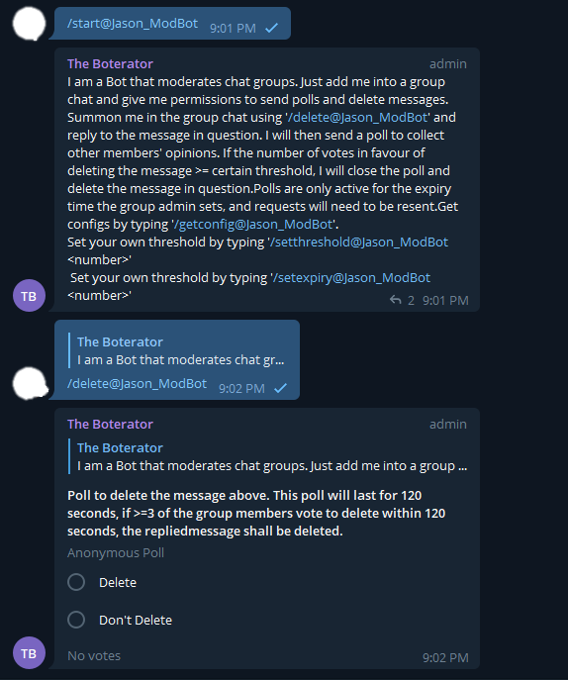

# Telegram moderation bot

Telegram bot that moderates a group chat by doing a majority poll vote. Bot has to be admin of the group chat with `delete` permission to work.

## Use

Use the hosted bot, or host your own.

[Add to your group](https://telegram.me/jason_modbot)

## Available commands

```text
/start or /help:    Help on how to use this Bot
/delete:            Reply to a message with this command to initiate poll to delete
/getconfig:         Get current threshold and expiry time for this group chat
/setthreshold:      Set a threshold for this group chat
/setexpiry:         Set a expiry time for the poll
/support:           Link back to this repo
```

## Installation

- Clone this repository
- Install docker and make
- Run `make start-modbot-prod`

## Screenshots


